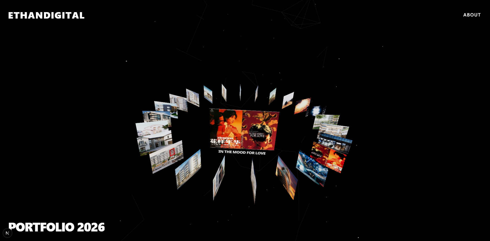

# EthanDigital Portfolio 2026



**An immersive, 3D interactive portfolio website.**
Combining the high-performance rendering capabilities of **React Three Fiber** with the server-side advantages of **Next.js**, this project delivers a digital experience characterized by spatial depth, parallax effects, and seamless cinematic transitions.

## ✨ Key Features

- **🌌 3D Ring Navigation System**
  - Custom circular layout algorithm based on trigonometric functions.
  - Implements physics-based inertial scrolling, mouse dragging, and wheel interaction.
  - **Dynamic Mouse Parallax Tilt**: Simulates real-world gravitational pull and depth within the 3D space.

- **🕸️ Native Particle Data Network**
  - **Zero External Dependencies**: Replaced legacy Vanta.js with a custom implementation using native Three.js `BufferGeometry`.
  - **High-Performance Rendering**: Renders 500+ particles with dynamic connections (topology) in a single draw call.
  - **Interactive Dynamics**: Features a slowly orbiting "galaxy" motion, breathing connection lines, and mouse-influence parallax, all integrated within the same Canvas to eliminate z-index layering issues.

- **🚀 Seamless Cinematic Transitions**
  - **"Spin & Expand" Effect**: Upon clicking a project, the ring accelerates and expands outward for a dramatic entry.
  - **Staggered Loading Architecture**: Ensures UI animations complete smoothly before loading heavy 3D assets.
  - **Smart Preloading**: Silently preloads high-definition project assets during the transition phase to prevent layout shifts.

## 🛠️ Tech Stack

- **Framework**: [Next.js 14](https://nextjs.org/) (App Router)
- **3D Engine**: [React Three Fiber (R3F)](https://docs.pmnd.rs/react-three-fiber) / [Three.js](https://threejs.org/)
- **3D Utilities**: [@react-three/drei](https://github.com/pmndrs/drei) (Used for Image, Text, and Sparkles components)
- **Styling**: [Tailwind CSS](https://tailwindcss.com/)
- **Animation**: R3F `useFrame` (Physics/Loop animations) + CSS Keyframes (UI animations)

## ⚡️ Getting Started

1. **Clone the repository**
   ```bash
   git clone [https://github.com/your-username/portfolio.git](https://github.com/your-username/portfolio.git)
   cd portfolio
2. **Install dependencies**
   ```bash
   npm install
   # or
   yarn install
3. **Run the development server**
   ```bash
   npm run dev
4. **Open in browser**
   Open http://localhost:3000 with your browser to see the result.

   📂 Project Structure
   ```bash

   src/
   ├── app/
   │   ├── globals.css        # Global styles (Handles transparent canvas setup)
   │   ├── layout.js          # Root layout with dynamic Navigation color control
   │   └── page.js            # Home entry point
   ├── components/
   │   └── canvas/
   │       └── RingInterface.js # Core 3D Component: Contains Ring logic, Particle Network, and Camera controls
   └── data/
       └── projects.js        # Data source for portfolio items

🎨 Design & Engineering Details
Visuals: Procedural Background
Instead of using heavy video files or GIFs, the background is generated in real-time using code. It creates a deep, slowly orbiting particle universe. The particles connect dynamically based on proximity, simulating a data topology, and respond subtly to mouse movements to create a sense of immersion.

Performance Optimization
Native Implementation: Moved away from Vanta.js to a custom R3F implementation to fix compatibility issues with modern Three.js (r160+) and improve frame rates.

Dynamic Imports: Used next/dynamic and React.lazy to split heavy 3D logic from the initial bundle.

Canvas Visibility Control: Utilized CSS opacity transitions and pointer-events management to ensure no white flashes occur during page navigation or asset loading.

BufferGeometry Optimization: The particle system manipulates buffer data directly rather than creating thousands of separate object instances, significantly reducing draw calls.

📄 License
MIT © 2026 EthanDigital
